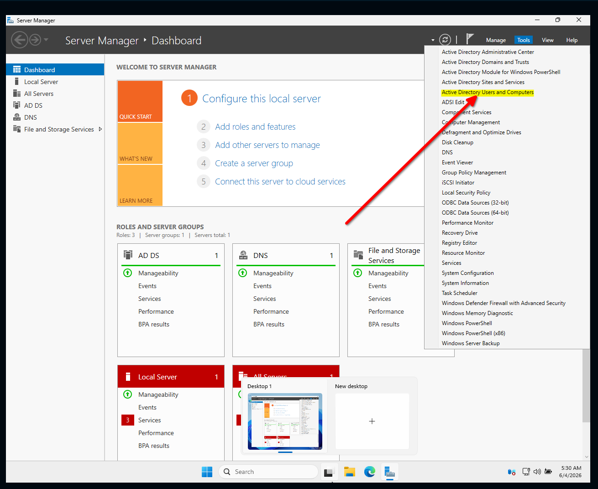
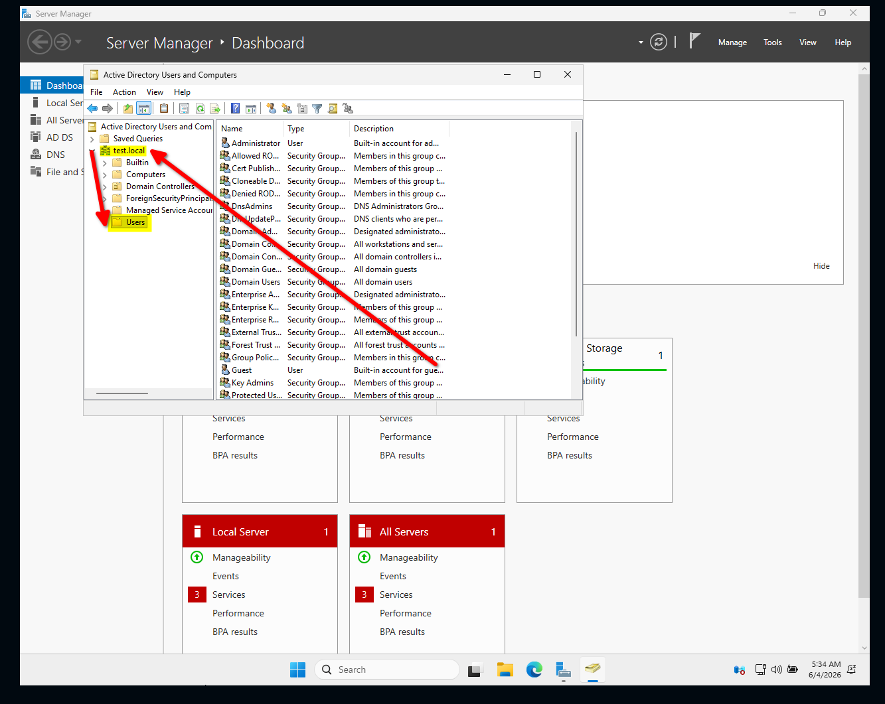
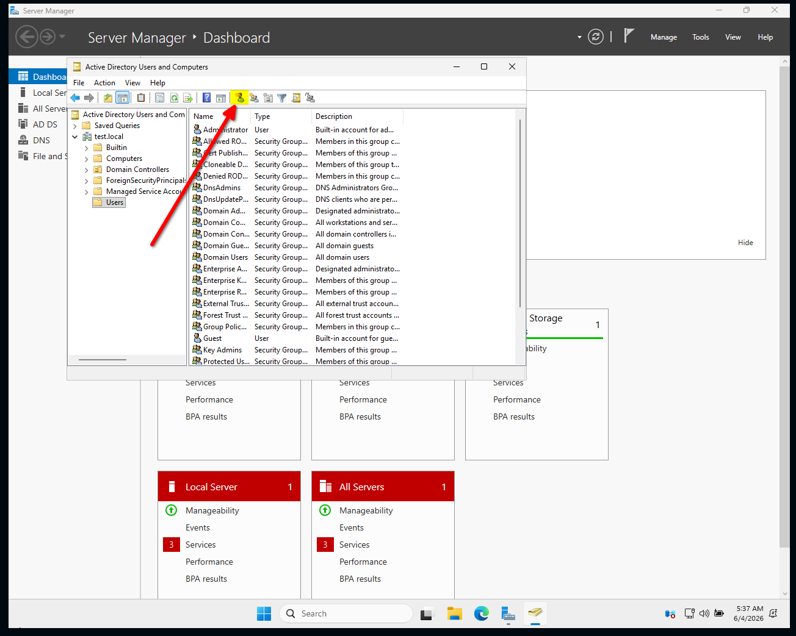
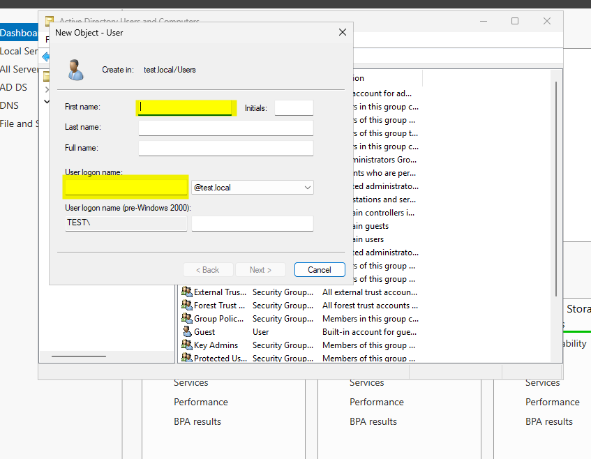
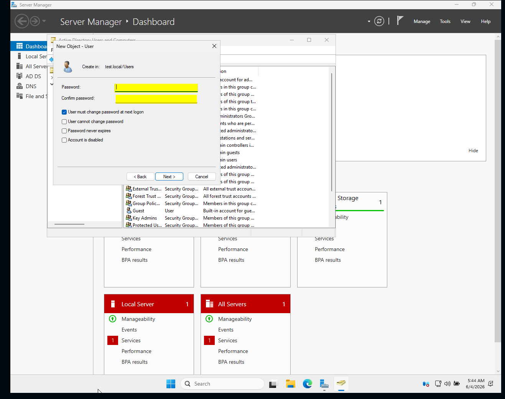

# Utvikling
	- ## nextjs
- # Drift
	- netverks skisse her er et nettversk skisse til denne bedriften som kan bli utvidey på segnere
- # Brukerstøte
	- ## Bruker i AD
	  collapsed:: true
		- Først gå til bruker og datamaskiner eller users and cumputer på engelsk.
		  
		- Så går du til Dit domene I me\it tilfele er det test.local so til user mappen som er under eller bruker vist du bruker norsk.
		  
			- Så går du til de små iconene på toppen og finner den enne personen med en sol fåran seg
			  
			- Så setter du in fornavn og login navn er de eneste som trengs nå man vist det er en onklig person leg til alt.
			  
			- Så et enkelt passord som du kan gi til personen som kommer til og loge seg in og etter på kan endre det selv.
			  id:: 6a27f21a-b88a-4f2c-8b4a-3a663194cb5b
			  
		- Det er også viktig og huske på have som er krav til passord til når man skal legge den til.
	- ## Mappe og fil tilgang AD
		-