# Utvikling
	- ## nextjs
- # Drift
	- netverks skisse her er et nettversk skisse til denne bedriften som kan bli utvidey på segnere
	  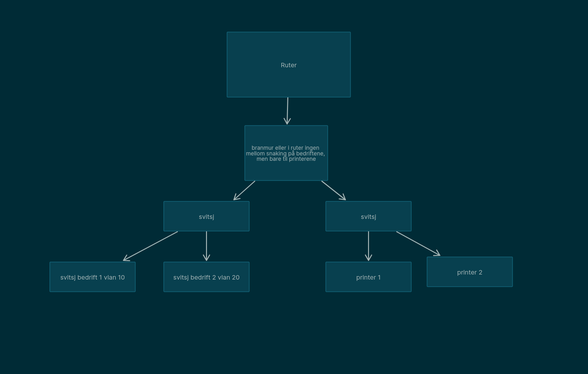
	- Får å få dette up settet trenger du først dette på svitsjen som er over bedriftene
	  ```
	  enable
	     config term
	     vlan 10
	     name bedrift_1
	     vlan 20
	     name bedrift_2
	     exit
	     
	     int fa0/1
	     switchport mode access
	     switchport access vlan 10
	     
	     int fa0/2
	     switchport mode access
	     switchport access vlan 20
	     
	     int fa0/24
	     switchport mode trunk
	  
	    ip access-list extended BLOCK_VLANS
	     deny ip 10.1.10.0 0.0.0.255 10.1.20.0 0.0.0.255
	     deny ip 10.1.20.0 0.0.0.255 10.1.10.0 0.0.0.255
	     permit ip any 10.1.30.0 0.0.0.255
	  ```
	- cisco oppset visning:
	  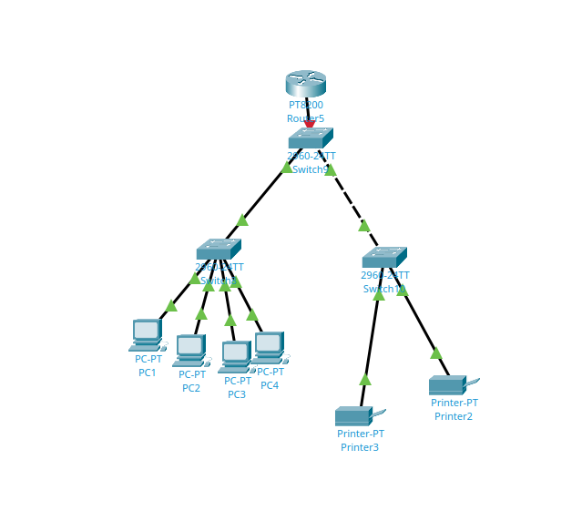
	  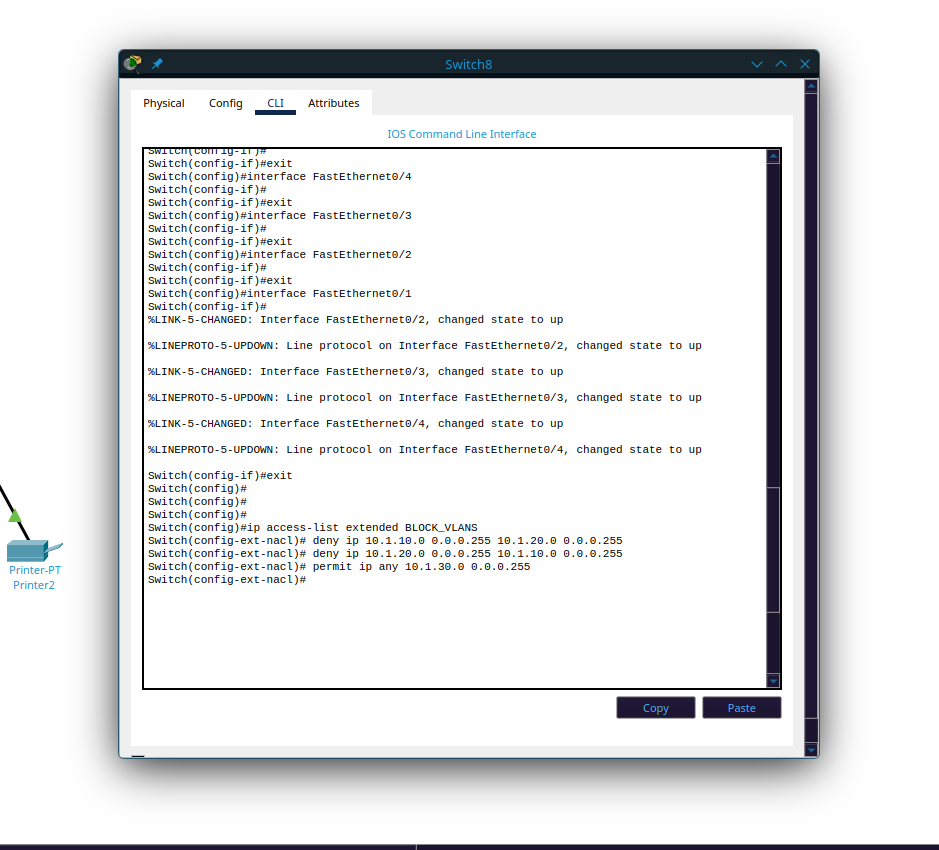
	  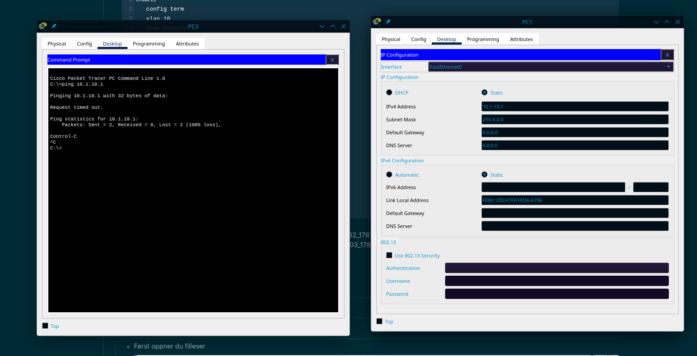
	-
- # Brukerstøte
	- ## Bruker i AD
	  collapsed:: true
		- Først gå til bruker og datamaskiner eller users and cumputer på engelsk.
		  
		- Så går du til Dit domene I me\it tilfele er det test.local so til user mappen som er under eller bruker vist du bruker norsk.
		  
			- Så går du til de små iconene på toppen og finner den enne personen med en sol fåran seg
			  
			- Så setter du in fornavn og login navn er de eneste som trengs nå man vist det er en onklig person leg til alt.
			  
			- Så et enkelt passord som du kan gi til personen som kommer til og loge seg in og etter på kan endre det selv.
			  id:: 6a27f21a-b88a-4f2c-8b4a-3a663194cb5b
			  
		- Det er også viktig og huske på have som er krav til passord til når man skal legge den til.
	- ## Mappe og fil tilgang AD
		- Først oppner du filleser
		  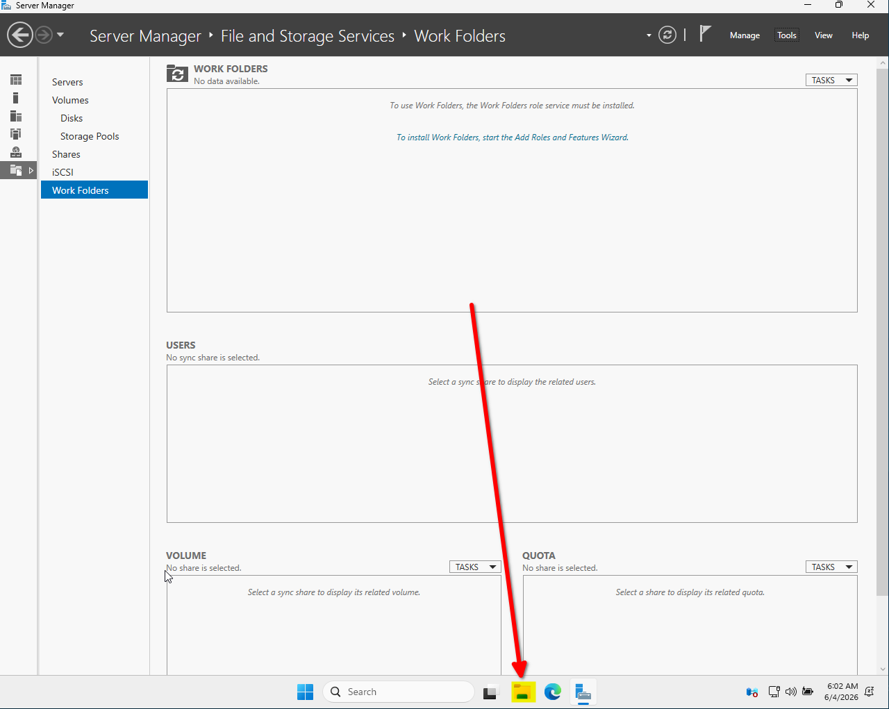
		- Så finner du denne pcen
		  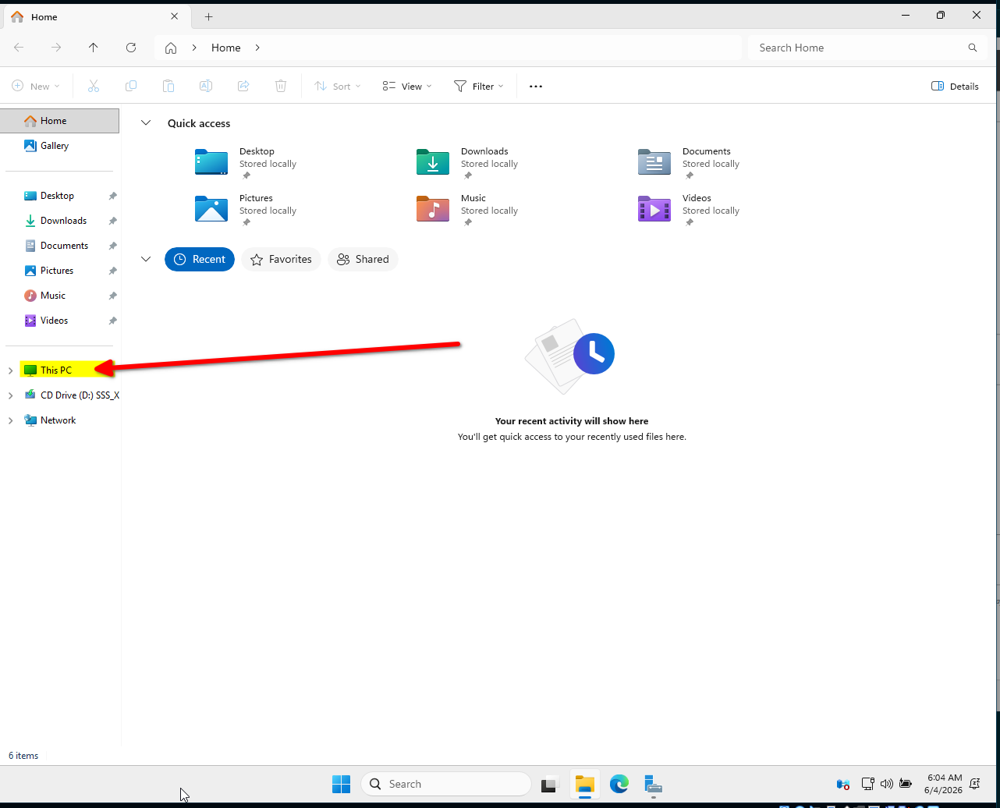
		- Så åpner du pcen slik:
		  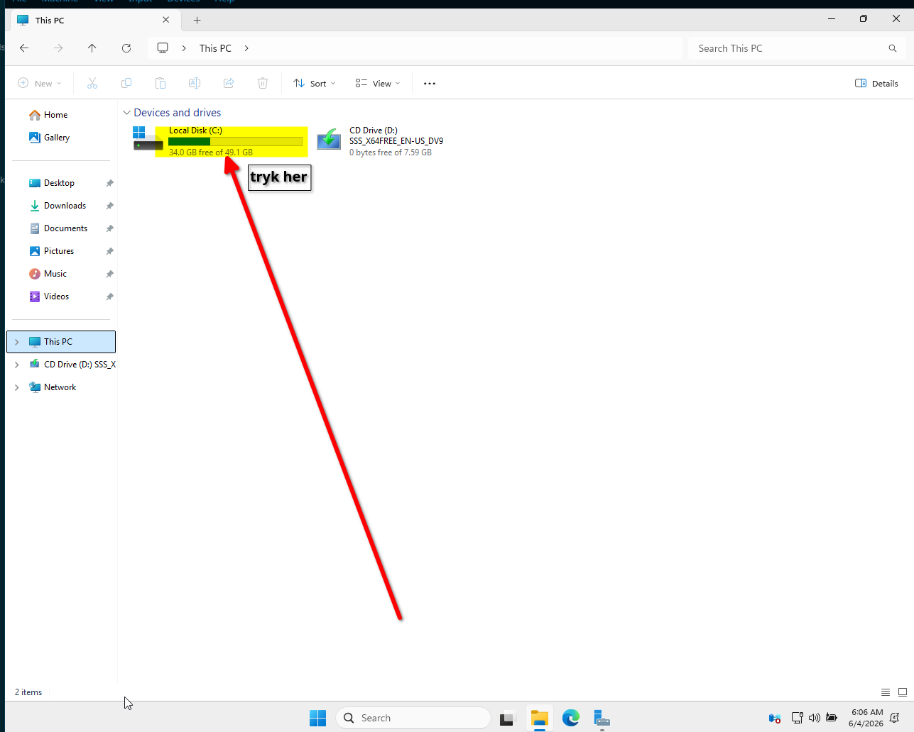
		- Så lager du en new mappe og kall det va som helst
		  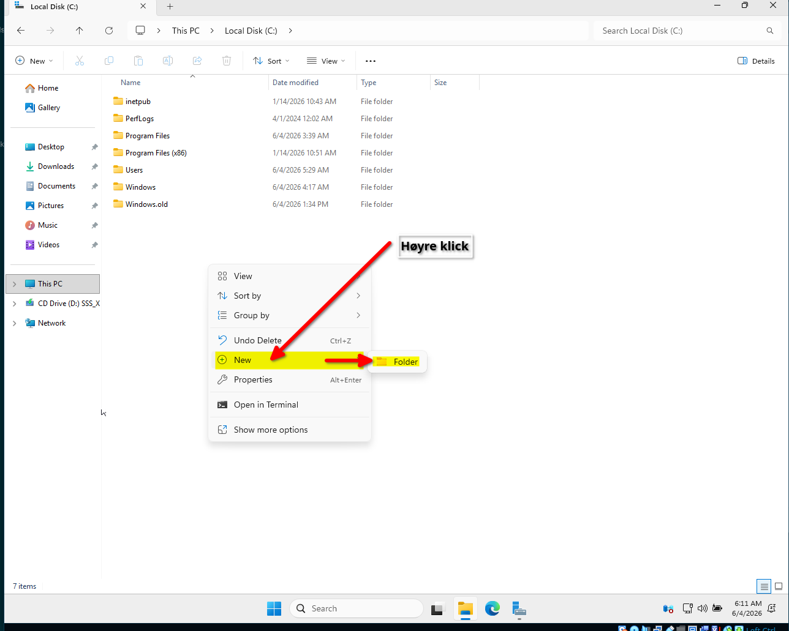
		- Så gå til propertise eller egenskaper på norsk
		  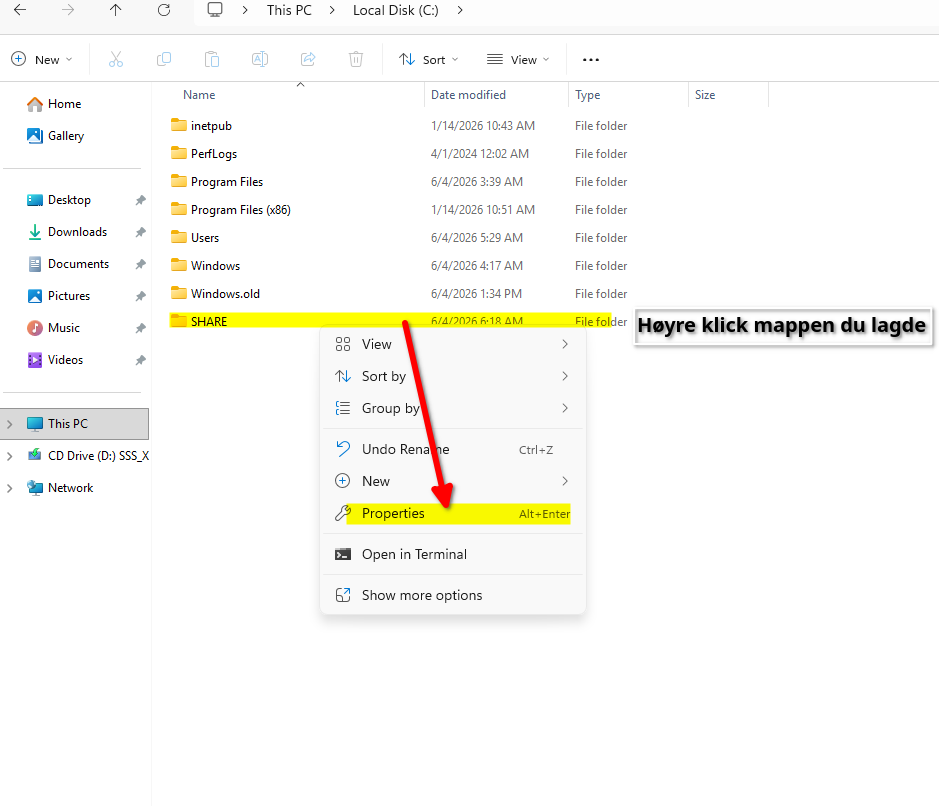
		- Så sharing eller deling også til avansert deller aler advansed sharing
		  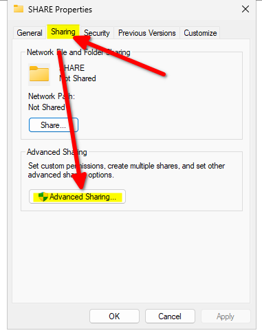
		- Så er resten dit med hvam som har tilgang og ikke.
		  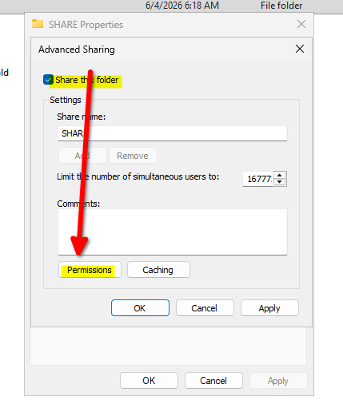
		- Så ok vist du ikke skal skyfte noe
		  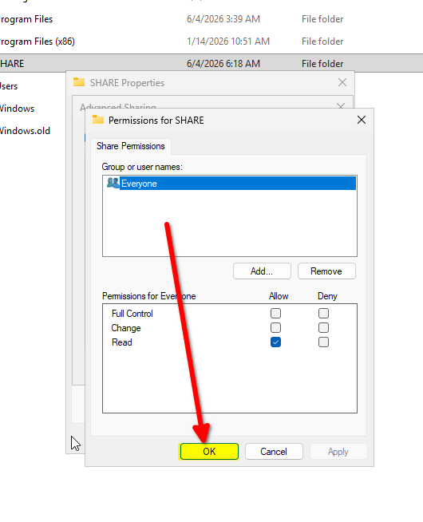
		- Det var alt så er du good
		  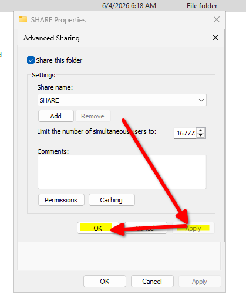